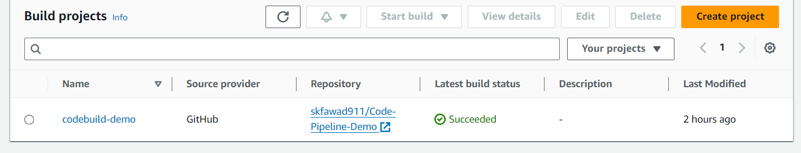
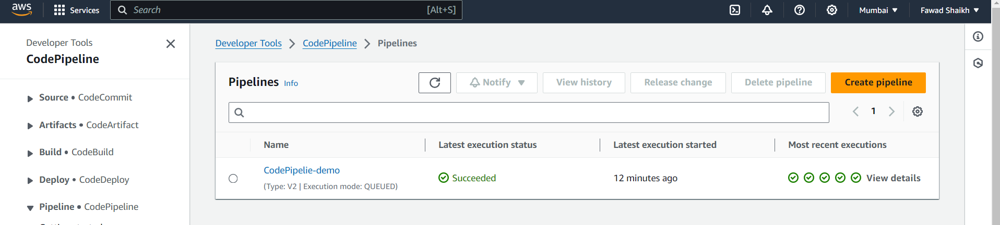
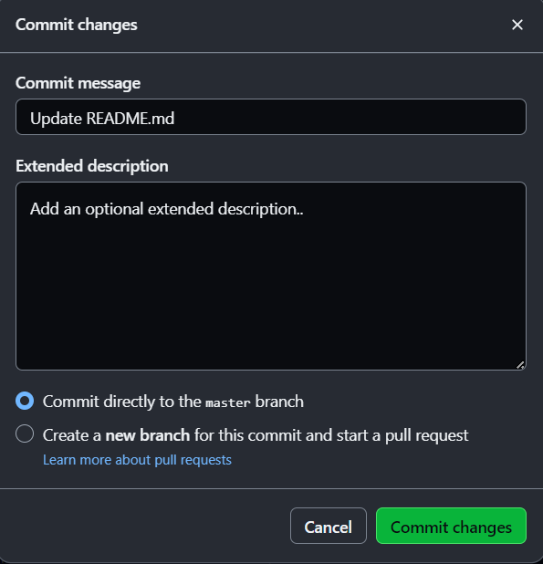
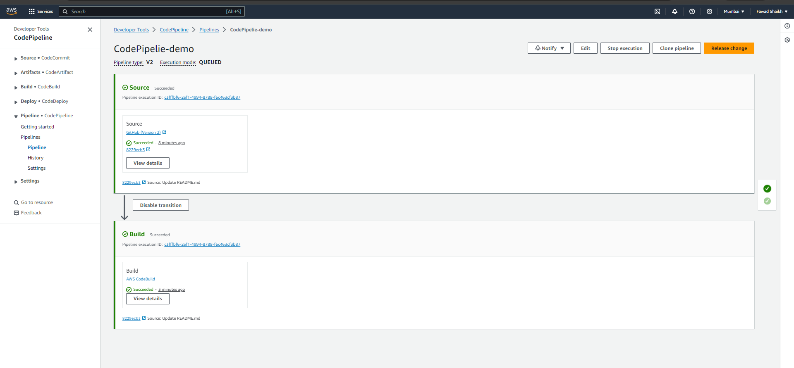

# CI/CD Pipeline for MERN Stack App on AWS

This repository contains the code and configurations for setting up a Continuous Integration (CI) pipeline on AWS using AWS CodeBuild and AWS CodePipeline for a MERN (MongoDB, Express.js, React.js, Node.js) stack application.

## Overview

The CI/CD pipeline automates the process of building and testing the application whenever changes are pushed to the GitHub repository. This ensures that the code remains in a deployable state at all times.

## Steps to Setup Continuous Integration (CI)

### Step 1: Create GitHub Repository

Create a GitHub repository and push your MERN stack application code to it.

### Step 2: Configure AWS CodeBuild

1. Navigate to the AWS Management Console and go to the AWS CodeBuild service.
2. Click on the "Create build project" button.
3. Provide a name for your build project.
4. Choose "GitHub" as the source provider and connect your GitHub account using OAuth.
5. Select the repository you created in Step 1.
6. Configure the build environment, specifying the operating system, runtime, and image.
7. Create a service role for CodeBuild if necessary.
8. Specify the buildspec.yml file for defining the build steps.
9. Review the build project settings and create your AWS CodeBuild project.
      
  

### Step 3: Create AWS CodePipeline

1. Go to the AWS Management Console and navigate to the AWS CodePipeline service.
2. Click on the "Create pipeline" button.
3. Provide a name for your pipeline and select the pipeline type.
4. Create a service role for CodePipeline if necessary.
5. For the source stage, choose "GitHub" as the source provider and connect your GitHub account.
6. Select the repository and branch to monitor for changes.
7. Review the pipeline configuration and create your AWS CodePipeline.

### Step 4: Skip Deployment (Optional)

Since i am  focusing on Continuous Integration in this setup, I can skip the deployment stage for now. This pipeline will automatically build and test your application whenever changes are pushed to the repository.
  

## Implementation 
Now if i make any commits on my github repository CodePipeline will automatically detect the change and invoke the Codebuild process

  
  
  

## Steps to Setup Continuous Deployement (CD)

Soon..............

## Additional Information

- For more details on AWS CodeBuild, refer to the [AWS CodeBuild Documentation](https://docs.aws.amazon.com/codebuild/index.html).
- For more details on AWS CodePipeline, refer to the [AWS CodePipeline Documentation](https://docs.aws.amazon.com/codepipeline/index.html).

